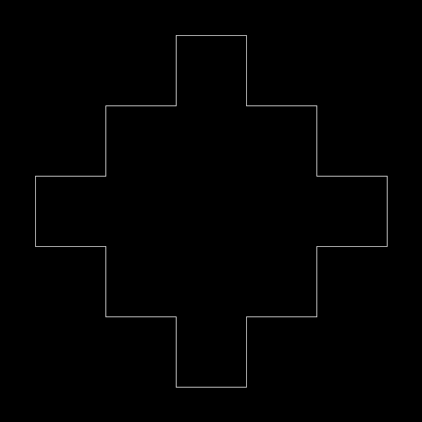
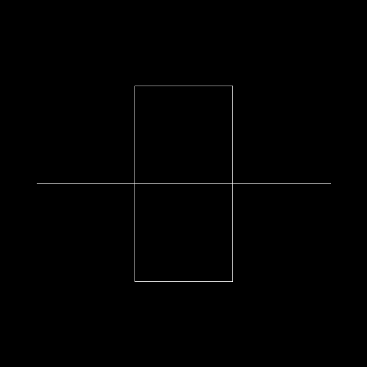

# Fractal Overload

[Fractals](https://fractalfoundation.org/resources/what-are-fractals/) are a fascinating thing that is normally
found in nature. It is a complex pattern where it makes a repetitive design. Look for a snowflake for example,
that can be considered a fractal.

With a specific bit of knowledge in programming and geometry such as recursion and linear transformation, you can also
produce interesting fractal patterns that might make you wonder how much can your computer handle the processing of the
recursion as the repetitive pattern goes smaller and smaller.


Using python opencv library and numpy, you can generate fractal patterns. Below are sample output with the level of
recursion applied.

### Usage

using pipenv

```bash
$ pipenv install
$ pipenv run fractal
```

using bare python

```bash
$ pip install numpy
$ pip install opencv-python
$ python main.py
```

code sample
```python
from image import Image
from peano import Peano

width, height = 600, 600
black = (0, 0, 0)
white = (255, 255, 255)

image = Image(height, width, black, white)
peano = Peano(image)
peano.draw(6)

# if you want to save the image
image.save_image('fractal.png')
```

### Samples

#### Koch

Level 0


Level 1


Level 2


Level 3


Level 4


#### Hat

Level 0


Level 1



Level 2


Level 3


Level 4


#### Peano

Level 0


Level 1



Level 2


Level 3


Level 4


### Inversed Koch

Level 0


Level 1


Level 2


Level 3


Level 4


